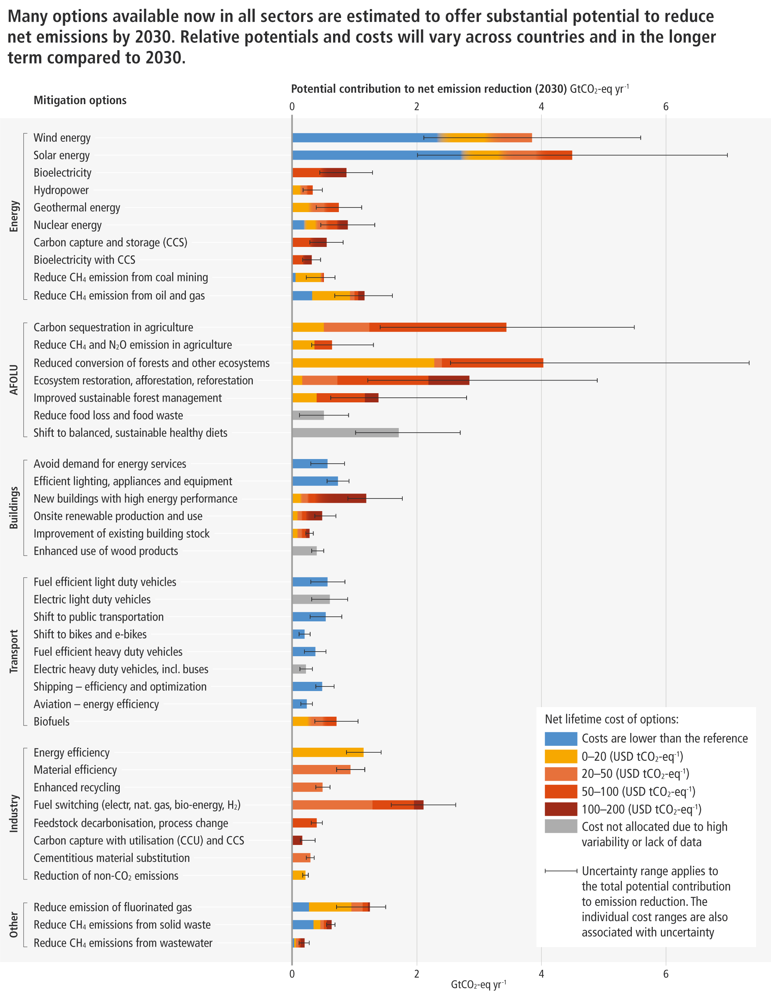

<h1 class="cv-h2"> Mitigation Compendium</h1>

The **Mitigation Compendium** is a comprehensive resource designed to simplify and categorise the vast array of climate mitigation options outlined by the Intergovernmental Panel on Climate Change (IPCC). By distilling the latest findings from the IPCC’s Working Group III reports, this compendium provides a clear, sector-based framework for understanding and implementing effective climate action strategies.

The compendium also serves as a bridge between the IPCC’s mitigation options and [Transition Elements](/3-transition-elements/index.md),  mapping these strategies onto the models in our sector hierarchy.

# Mitigation Options

-  __M-1 - Transport__{ .cv-inverted }
	  
	
	The transport sector is a significant contributor to global greenhouse gas (GHG) emissions, responsible for approximately **16%** of global CO₂ emissions.
	
	[Explore transport](/2-ipcc-mitigation-options/1-transport/index.md)

-    __M-2 - Industry__{ .cv-inverted }
	  

	The industry sector is a major contributor to global greenhouse gas (GHG) emissions, accounting for **31%** of global CO₂ emissions.

    [Explore industry](/2-ipcc-mitigation-options/2-industry/index.md)

-  __M-3 - AFOLU__{ .cv-inverted }
	
	
	The Agriculture, Forestry, and Other Land Use (AFOLU) sector is a critical component of global greenhouse gas (GHG) emissions, contributing **17%** of global CO₂ emissions.
	
	[Explore AFOLU](/2-ipcc-mitigation-options/3-afolu/index.md)

-  __M-4 -Buildings__{ .cv-inverted }
	
	
	The buildings sector is a significant source of global greenhouse gas (GHG) emissions, responsible for **19%** of global CO₂ emissions.
	
	[Explore buildings](/2-ipcc-mitigation-options/4-buildings/index.md)

-  __M-5 - Energy__{ .cv-inverted }
	
	
	The energy sector, after reallocating indirect emissions from electricity and heat generation to other sectors, is responsible for **13%** of global CO₂ emissions.
	
	[Read more](/2-ipcc-mitigation-options/5-energy/index.md)

-  __M-6 - Waste__{ .cv-inverted }
	
	
	The waste sector, while a smaller contributor at **3%** of of global CO₂-eq emissions, still plays a significant role in climate change, particularly through methane (CH₄) emissions.
	
	[Explore waste](/2-ipcc-mitigation-options/6-waste/index.md)

# AR6 Structure

The IPCC presents a clear hierarchical list of emission sources and methods for measuring and reporting emissions [@egglestonh.s.2006IPCCGuidelines2006]. For mitigation options there is currently no equivalent hierarchical list provided. The Working Group III contributions to the six rounds of assessment reports do cover many known mitigation options but do not catalogue nor number them explicitly. 

For this section we have chosen to use the Working Group III contribution to the Sixth Assessment Report of the IPCC [@ipccar6wg3ClimateChange20222022] as the structural base in order to derive a hierarchical list of mitigation options. 

Where necessary, earlier Assessment Reports [@ipccar5wg3ClimateChange20142014; @ipccar4wg3ClimateChange20072007] have been used  as complementary sources in order to provide as complete a list of mitigation options as possible. In these cases we have mapped mitigation options from the earlier assessment reports to the chapter structure of AR6.

The AR6 chapter structure for mitigation options is:

- Sectoral and systems (Chapters 6-11)
	- Energy Systems (Chapter 6)
	- AFOLU (Chapter 7)
	- Urban Systems and Other Settlements (Chapter 8)
	- Buildings (Chapter 9)
	- Transport (Chapter 10)
	- Industry (Chapter 11)
- Cross-sectoral Perspectives (Chapter 12)
- Demand, services and social aspects (Chapter 5)
- Innovation, technology development and transfer (Chapter 16)

Figure SPM.7 in the "Summary for Policymakers"  [@ipccar6wg3ClimateChange20222022] presents an overview diagram for mitigation options:

{  .on-glb data-title="Figure SPM.7" data-description="Overview of mitigation options and their estimated ranges of costs and potentials in 2030"  style="width: 33%; margin-left: 33%"}

This diagram has been central in generating the structure outlined below and used in this section of the website.

# Mitigation Compendium Structure

Given the IPCC's chapter breakdown, we have synthesised the following top-level sectors to create a more streamlined and effective hierarchy for categorising mitigation options:

1. **Transport:** This sector is directly derived from Chapter 10 of AR6, which focuses on the mitigation options specific to transport systems, including road, rail, air, and marine transportation. The sector is well-defined, with clear boundaries that allow for targeted mitigation strategies.
    
2. **Industry:** The industrial sector, covered in Chapter 11, encompasses a wide range of activities, including manufacturing, construction, and other industrial processes. By grouping these activities under one sector, we can address both energy-intensive and material-intensive aspects of industrial operations in a cohesive manner.
    
3. **AFOLU (Agriculture, Forestry, and Other Land Use):** Chapter 7 provides detailed analysis of mitigation options related to agriculture, forestry, and land use. Given the unique characteristics and significant emissions contributions of AFOLU, it is essential to treat this as a distinct sector. This sector includes both biological and land-based emissions and sinks, requiring specialised mitigation strategies.
    
4. **Buildings:** Chapter 9 focuses on the building sector, covering residential, commercial, and public buildings. This sector is crucial due to its high energy demand and the potential for significant emissions reductions through energy efficiency, materials, and design innovations.
    
5. **Energy:** Chapter 6 of AR6 addresses energy systems, which are central to all other sectors as they provide the necessary power for their operations. Energy systems are treated as a separate sector due to their cross-cutting nature and the diverse mitigation options available, including shifts to renewable energy, energy efficiency improvements, and innovations in energy storage and distribution.
    
6. **Waste:** Although not explicitly covered as a single chapter in AR6, waste management is a critical area of mitigation, involving the treatment and disposal of waste materials that contribute to emissions. Waste is often discussed within other sectors, such as AFOLU and industry, but its unique characteristics and mitigation opportunities justify its classification as a separate sector.
    

This top-level breakdown was derived by closely examining the structure and content of the AR6 chapters and identifying the key areas where sector-specific mitigation strategies are applicable. While the IPCC report provides a comprehensive overview of mitigation options across various systems and sectors, our approach aims to consolidate these options into a clear, actionable hierarchy. This allows for more targeted policy development and easier integration of mitigation strategies across different areas of climate action.

Furthermore, in cases where the IPCC chapters cover overlapping areas, such as Urban Systems (Chapter 8), which spans multiple sectors, we have integrated the relevant mitigation options into the most appropriate sector categories listed above. Urban systems, for example, involve energy, transport, buildings, and waste management; therefore, mitigation options discussed in Chapter 8 are mapped to these respective sectors within our hierarchy.

Thus this hierarchical structure facilitates a more practical and operational approach to climate mitigation, allowing for better alignment with Transition Elements as well as national and international climate policies, reporting frameworks, and implementation strategies.

